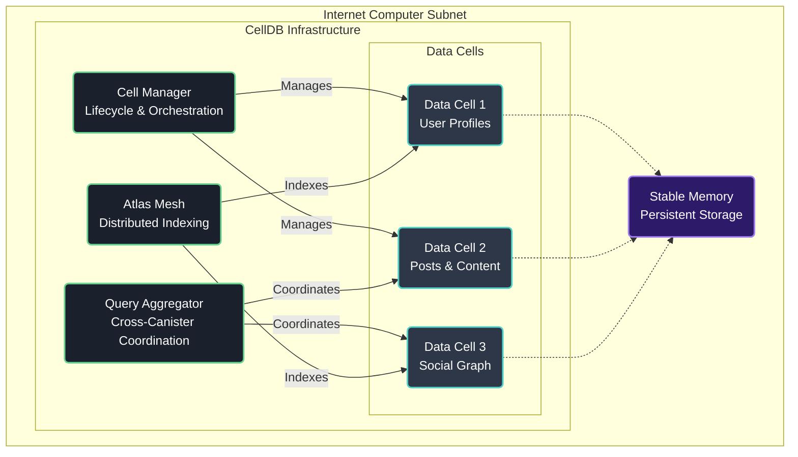

# CellDB: Serverless Database Framework for Internet Computer

[](https://internetcomputer.org)
[](https://github.com/dfinity/sdk)
[](https://rustlang.org)
[](LICENSE.md)
[](https://github.com/celldb/celldb)

CellDB is a serverless database framework architected specifically for the Internet Computer's actor-based computational model. Rather than adapting traditional database patterns to blockchain constraints, CellDB embraces the Internet Computer's unique capabilities through autonomous Data Cells—intelligent storage actors that encapsulate data schemas, business logic, and access control within individual canisters, leveraging orthogonal persistence and stable memory for optimal performance.

CellDB is currently in active development and represents a developer preview implementation. The framework is not yet ready for production deployment and APIs may change as development progresses. Early adopters and contributors are welcome to explore the codebase and provide feedback through GitHub issues.

## Overview

CellDB addresses the fundamental challenge facing Internet Computer developers: constructing sophisticated data-driven applications while maintaining economic viability and performance characteristics suitable for Web3 scale. Current approaches require 3-5x additional development overhead and consume 5-10x more cycles than necessary, creating barriers to building complex decentralized applications on the Internet Computer platform.

This early-access framework provides a comprehensive solution for data management on the Internet Computer through four core canister types that work in concert to deliver database functionality optimized for the platform's unique characteristics:

**Data Cells** serve as autonomous storage actors that combine data persistence with embedded business logic, validation rules, and access control mechanisms within individual canisters. Each Cell utilizes stable memory for efficient data storage and leverages the Internet Computer's orthogonal persistence model to maintain state across canister upgrades without explicit serialization overhead.

**Query Aggregators** coordinate cross-canister data operations through intelligent streaming interfaces that minimize expensive inter-canister calls while providing SQL-like query capabilities across multiple Data Cells. The aggregation layer implements cost-optimized batching strategies and result caching to achieve sub-500ms response times for complex operations.

**Atlas Mesh** delivers distributed indexing infrastructure that maintains eventually-consistent global indexes and full-text search capabilities across the Cell ecosystem, utilizing event-driven updates to minimize computational overhead while providing real-time query performance.

**Cell Manager** orchestrates the lifecycle of Data Cells, handling canister creation, schema versioning, horizontal scaling through automated Cell splitting, and resource allocation optimization based on usage patterns and subnet distribution.

## Architecture

The CellDB architecture leverages the Internet Computer's actor model where each canister operates as an independent computational unit with its own memory space and message queue. Inter-canister communication follows asynchronous patterns optimized for the platform's consensus mechanism, while stable memory utilization ensures data persistence across canister upgrades and subnet maintenance operations.



## File System Layout

```
celldb/
├── canisters/                      # Canister implementations
│   ├── cell_manager/               # Cell lifecycle management
│   │   ├── src/
│   │   │   ├── lib.rs             # Main canister logic
│   │   │   ├── state.rs           # Stable memory state management
│   │   │   └── types.rs           # Candid type definitions
│   │   └── cell_manager.did       # Candid interface specification
│   ├── data_cell/                 # Autonomous storage actors
│   │   ├── src/
│   │   │   ├── lib.rs             # Core Cell functionality
│   │   │   ├── schema.rs          # Schema validation and versioning
│   │   │   ├── storage.rs         # Stable memory operations
│   │   │   ├── validation.rs      # Data validation logic
│   │   │   └── access_control.rs  # Permission management
│   │   └── data_cell.did          # Cell interface specification
│   ├── query_aggregator/          # Cross-canister coordination
│   │   ├── src/
│   │   │   ├── lib.rs             # Aggregation logic
│   │   │   ├── streaming.rs       # Result streaming implementation
│   │   │   ├── coordination.rs    # Multi-canister orchestration
│   │   │   └── optimization.rs    # Query optimization engine
│   │   └── query_aggregator.did   # Aggregator interface
│   └── atlas_mesh/                # Distributed indexing
│       ├── src/
│       │   ├── lib.rs             # Mesh coordination
│       │   ├── indexing.rs        # Index management
│       │   ├── search.rs          # Full-text search
│       │   └── sync.rs            # Cross-mesh synchronization
│       └── atlas_mesh.did         # Mesh interface specification
├── sdk/                           # Developer interfaces
│   ├── rust/                      # Rust client library
│   ├── motoko/                    # Motoko integration modules
│   └── typescript/                # TypeScript/JavaScript SDK
├── examples/                      # Integration examples
│   ├── social_media/              # Social platform implementation
│   ├── dao_governance/            # DAO data management
│   └── gaming/                    # Real-time gaming data
├── tests/                         # Test suites
├── scripts/                       # Deployment automation
├── dfx.json                       # DFX project configuration
└── Cargo.toml                     # Rust workspace configuration
```

## Installation

### Prerequisites

CellDB requires the Internet Computer SDK and Rust toolchain for canister development:

```bash
# Install Internet Computer SDK
sh -ci "$(curl -fsSL https://internetcomputer.org/install.sh)"

# Install Rust with WebAssembly target
curl --proto '=https' --tlsv1.2 -sSf https://sh.rustup.rs | sh
rustup target add wasm32-unknown-unknown

# Verify DFX installation
dfx --version
```

### Local Development Setup

```bash
# Clone repository
git clone https://github.com/celldb/celldb
cd celldb

# Start local Internet Computer replica
dfx start --background --clean

# Deploy CellDB infrastructure canisters
dfx deploy --with-cycles 1000000000000

# Verify canister deployment
dfx canister status --all
```

### Network Deployment

For Internet Computer mainnet deployment:

```bash
# Deploy to Internet Computer mainnet
dfx deploy --network ic --with-cycles 1000000000000

# Configure cycles wallet for production
dfx identity --network ic get-wallet
dfx wallet --network ic balance
```

## Canister Descriptions

### Cell Manager

The Cell Manager canister serves as the orchestration layer for Data Cell lifecycle management, implementing canister creation, schema versioning, and resource allocation optimization. It maintains a registry of active Cells in stable memory and coordinates horizontal scaling operations through automated Cell splitting based on memory usage patterns and query load distribution.

**Key Responsibilities:**
- Dynamic canister creation using the Internet Computer Management Canister API
- Schema validation and version compatibility checking across Cell upgrades
- Resource allocation optimization based on subnet capacity and geographic distribution
- Automated horizontal scaling through intelligent Cell partitioning algorithms

### Data Cell

Data Cells represent the core storage abstraction, implemented as autonomous actors that encapsulate data schemas, validation logic, and access control within individual canisters. Each Cell utilizes stable memory structures for efficient data persistence and implements query interfaces optimized for the Internet Computer's message passing model.

**Key Characteristics:**
- Orthogonal persistence leveraging stable memory for zero-downtime upgrades
- Embedded validation logic executing within the canister context
- Granular access control using Internet Computer principal-based authentication
- Query interfaces optimized for both synchronous and asynchronous access patterns

### Query Aggregator

The Query Aggregator implements cross-canister coordination through intelligent streaming interfaces that minimize the cost overhead of inter-canister calls. It provides SQL-like query capabilities across multiple Data Cells while maintaining performance characteristics suitable for real-time applications through result caching and batch optimization strategies.

**Architecture Features:**
- Asynchronous query execution with result streaming to minimize latency
- Intelligent batching algorithms that optimize inter-canister call patterns
- Query result caching with configurable TTL and invalidation strategies
- Cost optimization through cycle consumption analysis and execution planning

### Atlas Mesh

Atlas Mesh provides distributed indexing infrastructure that maintains eventually-consistent global indexes across the Data Cell ecosystem. It implements full-text search capabilities and materialized view maintenance through event-driven updates that minimize computational overhead while ensuring index freshness.

**Indexing Capabilities:**
- Eventually-consistent global indexes using event-driven update propagation
- Full-text search with configurable stemming and relevance scoring algorithms
- Materialized view maintenance with intelligent refresh scheduling
- Cross-mesh synchronization for multi-subnet deployments

## SDKs

### Rust SDK

The Rust SDK provides native integration with Internet Computer development patterns, offering type-safe interfaces for canister interaction and efficient serialization using Candid.

```rust
use celldb::prelude::*;

#[tokio::main]
async fn main() -> Result<()> {
    let agent = Agent::builder()
        .with_url("https://ic0.app")
        .build()?;

    let cell_manager = CellManager::new(&agent, cell_manager_id);
    let cell = cell_manager.create_cell(CellConfig {
        schema: UserSchema::new(),
        permissions: PermissionConfig::default(),
    }).await?;

    Ok(())
}
```

### TypeScript SDK

The TypeScript SDK enables frontend integration with CellDB infrastructure through agent-js compatibility and automatic type generation from Candid interfaces.

```typescript
import { CellDB } from '@celldb/sdk';

const celldb = await CellDB.create({
  host: 'https://ic0.app',
  identity: identity,
});

const userCell = await celldb.getCell('users');
const result = await userCell.query({
  filter: { status: 'active' },
  limit: 50
});
```

### Motoko Integration

Motoko modules provide native actor integration patterns for canister-to-canister communication within the Internet Computer ecosystem.

```motoko
import CellDB "mo:celldb";

actor MyApplication {
    private let userCell = actor("rdmx6-jaaaa-aaaah-qdrva-cai") : CellDB.DataCell;

    public func getUserData(userId: Principal) : async ?CellDB.Record {
        await userCell.query(#ById(userId))
    };
}
```

## Examples

### Social Media Platform

Demonstrates multi-Cell coordination for user profiles, posts, and social graph relationships with real-time activity feeds:

```rust
// User Cell for profile management
let user_cell = cell_manager.create_cell(UserCellConfig {
    schema: UserSchema::with_fields([
        ("username", FieldType::Text { max_length: Some(50) }),
        ("profile", FieldType::Object(profile_fields)),
    ]),
    indexes: vec!["username", "created_at"],
}).await?;

// Post Cell for content storage
let post_cell = cell_manager.create_cell(PostCellConfig {
    schema: PostSchema::with_references([
        ("author", Reference::to_cell(&user_cell)),
    ]),
    partitioning: PartitionStrategy::ByAuthor,
}).await?;

// Query Aggregator for activity feeds
let feed_aggregator = query_aggregator.create_stream(StreamQuery {
    cells: vec![user_cell.id(), post_cell.id()],
    query: "SELECT p.*, u.username FROM posts p JOIN users u ON p.author = u.id
            WHERE p.created_at > ? ORDER BY p.created_at DESC",
    parameters: vec![since_timestamp],
}).await?;
```

## Developer Quickstart

### 1. Environment Setup

```bash
# Verify Internet Computer SDK installation
dfx --version

# Create new CellDB project
npx create-celldb-app my-project
cd my-project

# Start local development environment
dfx start --background
```

### 2. Define Data Schema

```rust
use celldb::schema::*;

#[derive(CandidType, Deserialize)]
struct UserRecord {
    id: Principal,
    username: String,
    email: Option<String>,
    created_at: u64,
}

impl Schema for UserRecord {
    fn definition() -> SchemaDefinition {
        SchemaDefinition::new()
            .field("id", FieldType::Principal)
            .field("username", FieldType::Text { max_length: Some(50) })
            .field("email", FieldType::OptionalText)
            .field("created_at", FieldType::Timestamp)
            .index("username")
            .constraint(UniqueConstraint::new(vec!["username"]))
    }
}
```

### 3. Deploy and Test

```bash
# Deploy CellDB infrastructure
dfx deploy

# Create and test Data Cell
dfx canister call cell_manager create_cell '(
    record {
        name = "users";
        schema = record { /* schema definition */ };
        permissions = record { /* permission config */ };
    }
)'

# Query Cell data
dfx canister call data_cell query '(
    record {
        conditions = vec { /* filter conditions */ };
        limit = 10;
    }
)'
```

## Performance & Benchmarks

CellDB performance characteristics are optimized for Internet Computer's computational model and cycle economy. The following benchmarks represent target performance goals for the framework upon completion:

### Single-Cell Operations
- **Insert Operations**: 80-150ms average latency, 1,000-2,500 ops/second throughput
- **Query Operations**: 50-120ms for indexed lookups, 100-300ms for filtered scans
- **Memory Efficiency**: 60-75% reduction in stable memory usage through compression
- **Cycle Consumption**: 200K-800K cycles per operation depending on complexity

### Cross-Cell Aggregation
- **Simple Joins**: 200-400ms for 2-3 Cell coordination
- **Complex Aggregations**: 500ms-1.2s for statistical operations across multiple Cells
- **Streaming Queries**: 100-250ms initial response, 50-100ms per subsequent batch
- **Cache Hit Performance**: 20-80ms for frequently accessed query patterns

### Economic Sustainability
Based on architectural projections:
- Typical social media application (100K users, 1M posts): ~2-3 GB stable memory usage
- Estimated monthly infrastructure cost: $12-18 USD equivalent in ICP cycles
- Target 65-80% cycle cost reduction compared to naive cross-canister patterns
- Query result caching projected to provide 40-70% cycle savings for repeated operations

## Testing

CellDB includes comprehensive test suites covering unit, integration, and performance scenarios:

```bash
# Run complete test suite
cargo test

# Unit tests for individual canisters
cargo test --package cell_manager
cargo test --package data_cell
cargo test --package query_aggregator

# Integration tests with local replica
dfx start --background
./scripts/run-integration-tests.sh

# Performance benchmarks
cargo bench
```

### Test Coverage Areas
- **Schema Validation**: Type checking, constraint enforcement, migration compatibility
- **Access Control**: Principal-based authentication, role-based authorization
- **Query Optimization**: Execution plan generation, result caching, cycle optimization
- **Canister Upgrades**: State preservation, schema migration, zero-downtime deployments
- **Error Handling**: Network failures, canister unavailability, resource exhaustion scenarios

## Contributing

CellDB is actively seeking contributors to accelerate development. Areas of particular interest include:

- **Query Optimization**: Advanced algorithms for cross-canister query planning
- **Index Management**: Efficient data structures for distributed indexing
- **SDK Development**: Language bindings and developer tooling improvements
- **Performance Testing**: Comprehensive benchmarking and optimization analysis

Please review the [Internet Computer Security Best Practices](https://internetcomputer.org/docs/current/references/security/) when contributing canister code.

## License

This project is licensed under the MIT License. See [LICENSE.md](LICENSE.md) for complete terms.

---

For technical discussions and development coordination, join the conversation on the [Internet Computer Developer Forum](https://forum.dfinity.org). Bug reports and feature requests should be submitted through [GitHub Issues](https://github.com/celldb/celldb/issues).